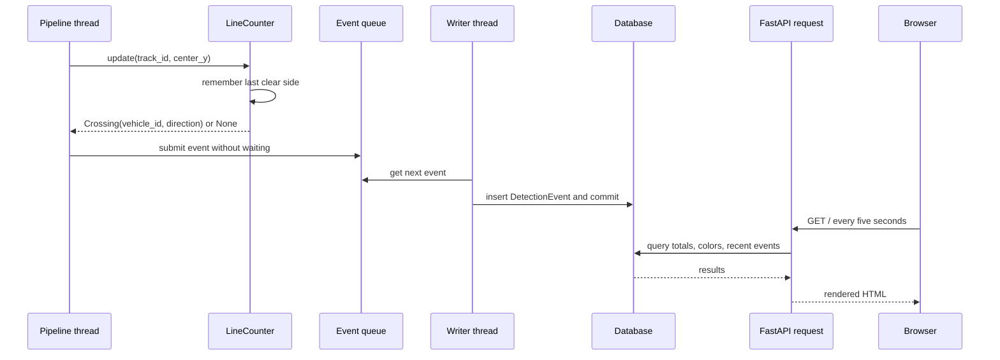

# Project Flow and System Design

This guide follows one frame and one vehicle crossing from input to dashboard. It describes the implementation in this repository, including the optional RTSP path.

## 1. Architecture at a glance

```mermaid
flowchart LR
    Video[MP4, camera, or RTSP URL]
    Publisher[Optional Python FFmpeg publisher]
    Broker[Optional MediaMTX]
    Capture[OpenCV VideoCapture]
    Detector[YOLO COCO detector]
    Tracker[ByteTrack tracker]
    Color[HSV color heuristic]
    Counter[Horizontal line counter]
    Queue[Bounded in-memory event queue]
    Writer[Background database writer]
    DB[(SQLite by default or PostgreSQL)]
    API[FastAPI JSON API]
    Page[Jinja dashboard]
    Browser[Browser refreshes every 5 seconds]

    Video --> Capture
    Video --> Publisher --> Broker --> Capture
    Capture --> Detector --> Tracker
    Tracker --> Color
    Tracker --> Counter
    Color --> Counter
    Counter -->|crossing event| Queue --> Writer --> DB
    DB --> API --> Page --> Browser
```

The straight `Video -> Capture` connection is the default local MP4 path. The publisher and MediaMTX are optional. When using RTSP, set `VIDEO_SOURCE` to the MediaMTX stream URL.

## 2. What happens at startup

When the application starts, FastAPI enters its lifespan function in `vehicle_analytics/web.py`:

1. SQLAlchemy runs `Base.metadata.create_all` to create the event table if needed.
2. `EventWriter` starts a daemon thread that waits for queued crossing events.
3. `PipelineRunner` starts a daemon thread for video processing.
4. FastAPI accepts browser and API requests while those threads work.

The pipeline thread loads the configured YOLO weights, creates a tracker session ID, opens the selected video source, reads its dimensions, calculates the horizontal count line, and optionally opens a video writer for annotated frames.

If weights are not present locally, Ultralytics downloads them on first model load. If OpenCV cannot open the selected source, the pipeline enters its error state and exposes the error through `/api/health`.

## 3. One-frame processing flow

For each frame read by OpenCV:

1. If the configured inference stride says to skip this frame, it is not sent to YOLO. If annotated output is enabled, that raw frame is still written.
2. Otherwise, YOLO runs detection on the frame, filtered to car, motorcycle, bus, and truck.
3. ByteTrack associates current detections with existing track IDs using persistent tracker state.
4. For each box with a tracker ID, the pipeline clips its coordinates to the image and crops the vehicle pixels.
5. `classify_color` estimates the color from the crop.
6. The vertical center of the box is passed to `LineCounter` with its track ID.
7. The box, class, ID, color label, count line, and local total are drawn on the frame.
8. When the counter reports a crossing, the pipeline sends an event payload to `EventWriter.submit`.
9. The annotated frame is written if `SAVE_ANNOTATED_VIDEO` is enabled.
10. The pipeline updates its processed-frame count and last-frame time for health reporting.

The model processes one frame per `model.track` call. The code uses CPU/GPU selection provided by the installed PyTorch and Ultralytics runtime; this project does not hard-code a CUDA device.

## 4. Crossing and event flow

The line counter uses `COUNT_LINE_POSITION * frame_height`. Its deadband preserves the last clear side while a tracked center is near the line. A side change creates one crossing. `counted` prevents the same track from creating another crossing during that process session.

The crossing event contains:

| Field | Example | Meaning |
|---|---|---|
| `event_id` | UUID | Unique event-record identifier |
| `stream_name` | `traffic-camera-01` | Configured source label |
| `vehicle_id` | `51a6b98bb6:75` | Pipeline session plus ByteTrack ID |
| `vehicle_class` | `car` | COCO vehicle category |
| `color` | `silver` | HSV-based estimate |
| `direction` | `up` or `down` | Direction across the horizontal line |
| `confidence` | `0.75` | Detection confidence from YOLO |
| `crossed_at` | UTC timestamp | Processing time when the event is submitted |

The timestamp is when the application handles the crossing, not a presentation timestamp extracted from the original video frame.

## 5. Why there are two processing threads

The video thread should spend its time reading and analyzing frames. A database can be slower or temporarily unavailable. To avoid making every crossing wait for a database commit, the pipeline puts events on a bounded queue and returns to frame processing. A separate writer thread performs synchronous SQLAlchemy inserts.

This design limits inference blocking, but it does not guarantee durable delivery. If the queue fills, an event is dropped and `dropped_events` increases. If an insert raises a SQLAlchemy error, the error is logged and exposed as `last_error`, but that queued event is not retried. The queue is in memory, so a process crash can also lose events that have not yet committed.

## 6. Data storage and dashboard reads

`DetectionEvent` maps to `detection_events`. The model can create the same basic table in SQLite or PostgreSQL. SQLite is the default file-based option. PostgreSQL is configured through a `DATABASE_URL` with the Psycopg driver.

The dashboard route and API call SQLAlchemy queries:

- The total is a `COUNT` over all events.
- Today's count filters on a UTC start-of-day timestamp.
- Color totals group rows by `color`.
- Recent rows sort by `crossed_at` descending.

`/api/events` returns a JSON list with a requested limit from 1 to 500. `/api/health` reports the database dialect, pipeline snapshot, event queue depth, persisted and dropped counts, and last writer error. Its top-level `status` currently says `ok` even if `pipeline.status` is `error`; use the nested pipeline fields to diagnose inference.

The root dashboard page is rendered on the server with Jinja and automatically reloads every five seconds. It shows totals, all-time color breakdown, recent crossings, frames processed in the current process session, and queue depth. It is polling by page refresh rather than a WebSocket connection.

## 7. Optional MediaMTX flow

To use MediaMTX, the Compose file starts a PostgreSQL service and MediaMTX. The `traffic` path accepts a publisher. In a second terminal, the project can start FFmpeg to publish `traffic.mp4` repeatedly over RTSP/TCP to `rtsp://127.0.0.1:8554/traffic`.

Then configure `VIDEO_SOURCE=rtsp://127.0.0.1:8554/traffic`. The pipeline still uses OpenCV for capture; MediaMTX is an intermediary and stream server. `probe-rtsp` asks the bundled FFmpeg to read a frame as a connectivity check. The dashboard does not currently embed the HLS or WebRTC stream.

## 8. Important implementation decisions

### Python-only, portable inference

The project uses Python, OpenCV, Ultralytics, and ByteTrack. NVIDIA DeepStream was part of the assignment specification, but is a Linux/NVIDIA SDK and is not the inference runtime used here. The implementation therefore does not contain a DeepStream/GStreamer pipeline.

### Rule-based color estimate

HSV classification uses only the detected crop and does not need a second model. This keeps the pipeline small and fast but makes color approximate. A true secondary trained classifier would need labeled training data and separate model integration; it is not present.

### Local usability first

SQLite makes it possible to run the app without Docker or PostgreSQL. Compose provides optional PostgreSQL and MediaMTX services for a service-based setup.

### Python-rendered dashboard

FastAPI and Jinja serve the dashboard directly. There is no React app or Node.js build. This keeps the application and dashboard implementation in Python plus an HTML template and CSS.

## 9. What the implementation does not currently do

- It does not use NVIDIA DeepStream or NVDS analytics.
- It does not run a learned secondary vehicle-color model.
- It does not reconnect automatically after an RTSP/camera read failure.
- It does not retry database insert failures or persist the in-memory queue.
- It does not embed the video feed into the dashboard.
- It does not use WebSockets or server-sent events; the page reloads every five seconds.
- It does not permanently identify a physical vehicle across tracker loss or application restarts.
- It does not have schema migrations, authentication, or production secret management.

## 10. A short project explanation for an interview

> This is a Python vehicle analytics application. OpenCV reads a sample file or camera stream, and Ultralytics YOLO detects the four COCO vehicle classes. ByteTrack keeps temporary IDs between frames. I estimate color from the center of each vehicle crop using HSV thresholds, then a line counter remembers each track's last clear side and emits one crossing event. A bounded queue hands events to a background SQLAlchemy writer, which stores them in SQLite by default or PostgreSQL when configured. FastAPI exposes health, stats, and events endpoints and renders a Jinja dashboard that refreshes every five seconds. RTSP publishing through MediaMTX is optional.

If asked about deviations from the original assignment, be direct: the current implementation uses Python YOLO/ByteTrack rather than DeepStream, and its color logic is a heuristic rather than a trained secondary classifier.
